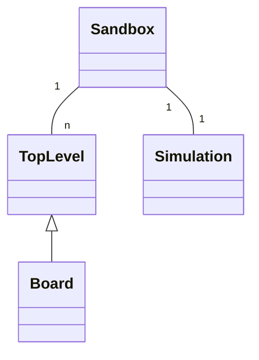
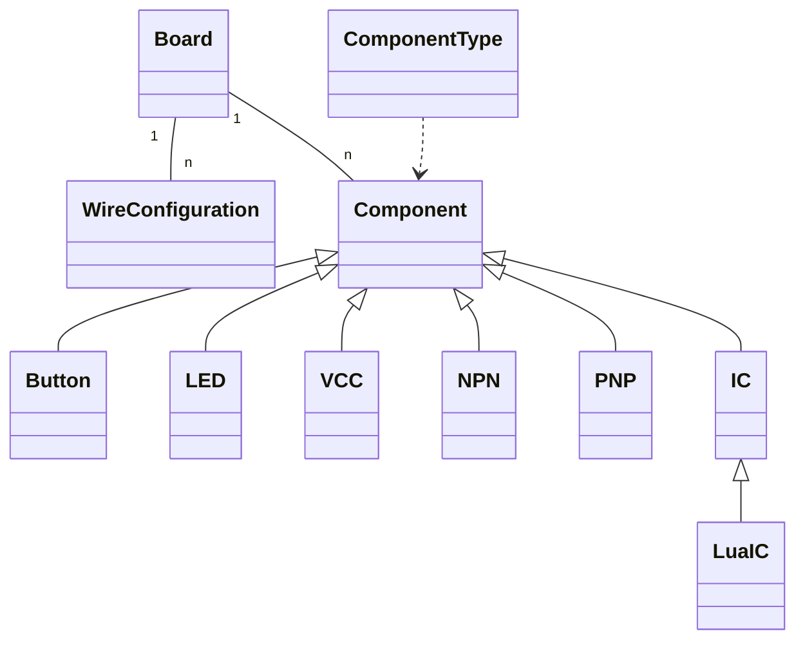
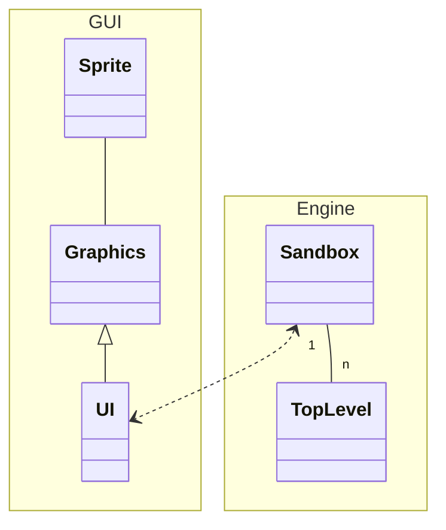

# The Transistor Project - Hacking

Project contains 3 major classes:

* `Sandbox` - circuit building and simulation
* `Game` - levels and story
* `Graphics` / `UI` - user interaction with sandbox and game

## Sandbox

The `Sandbox` is where users can interact and build circuits, and make them run. Each `Sandbox` is composed of:

* a set of `TopLevels`: which can be usually boards, or other devices such as monitors or keyboards
* a `Simulation`, there the `Sandbox` is compiled and executed.

### Board (TopLevel)

`Boards` contains `Wires` and `Components`.

`Wires` can have a bit width (1 to 8) and a board side (top or bottom). They are cross-shaped, so can be any combination
of [N, S, W, E] in a tile.

`Components` can be simple on-tile components, or components that extend multiple tiles with multiple pins 
(`IC` - integrated circuit). ICs can also be extended by users with Lua.

There's a default set of component types called `default_component_types`. A component is created from a
`ComponentType`. A `ComponentType` is like a class, that contains default component information (size, image), and
`Component` is it's implementation, which holds information about the component state (ex. is a button presed).

### Simulation

Whenever a Sandbox is changed, it goes through the `Compiler`, which generates a new `Simulation`. The compiler looks
for all connected pins, and from it creates a `Connection`. At each simulation step, the `Simulation` simulates the
`Components` based on their current pin values, and based on that, updates its `Connections`.

_TODO : create diagram_

## Game

Not implemented yet.

## Graphics / UI

`Graphics` is an interface that is implemented by `UI`, which is a SDL2 implementation. Other implementations
can easily bye added in the future.

The game loop has two steps:

* __update__: the `UI` receives user interaction and identifies to which `TopLevel` in `Sandbox` the event refers to,
              and then passes that event to the `TopLevel`. 
* __draw__: the `UI` draws the GUI, background, and then each of the `TopLevels`. Each `TopLevel` has callbacks to
            `Graphics`, where each element is actually drawn.

Most of the drawing is based on `SpriteSheet`, which contains the texture atlas for the images in the game.

