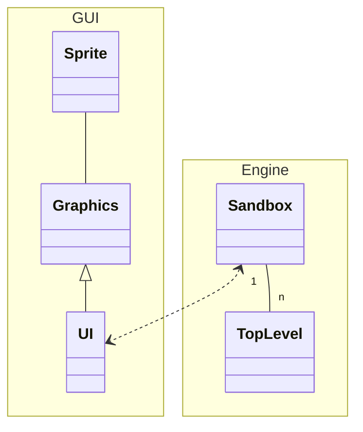

# The Transistor Project - Hacking

Project contains 3 major classes:

* `Sandbox` - circuit building and simulation
* `Game` - levels and story
* `Graphics` / `UI` - user interaction with sandbox and game

## Sandbox

## Game

## Graphics / UI

`Graphics` is an interface that is implemented by `UI`, which is a SDL2 implementation. Other implementations
can easily bye added in the future.

The game loop has two steps:

* __update__: the `UI` receives user interaction and identifies to which `TopLevel` in `Sandbox` the event refers to,
              and then passes that event to the `TopLevel`. 
* __draw__: the `UI` draws the GUI, background, and then each of the `TopLevels`. Each `TopLevel` has callbacks to
            `Graphics`, where each element is actually drawn.

Most of the drawing is based on `SpriteSheet`, which contains the texture atlas for the images in the game.

